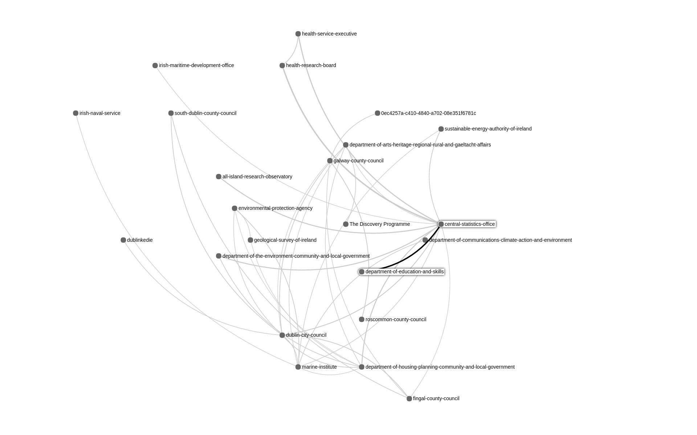

Open Gov Data Comparision and Relatedness Analysis Service [Not only CKAN based]
=====================
Refined Generic Version of 
https://github.com/mohadelrezk/open-gov-collaboration-analysis


mongodb installation [one time only]
------------------------------------

https://docs.mongodb.com/master/administration/install-community/


DBpedia Spotlight Installation [one time only]
--------------------------------

https://github.com/dbpedia-spotlight/dbpedia-spotlight/wiki/Run-from-a-JAR

```
$ wget http://downloads.dbpedia-spotlight.org/spotlight/dbpedia-spotlight-1.0.0.jar

$ wget http://downloads.dbpedia-spotlight.org/2016-04/en/model/en.tar.gz

$ tar xzf en.tar.gz
```


Stanford NER Installation [one time only]
-----------------------
........


Service installation [one time only]
--------------------
```
$ virtualenv venv

$ source venv/bin/activate

$ pip install -r requirements.txt
```

Service configuration
--------------------

util/config.py [setting DBpedia and Stanford NER credinalities]


Running the service:
--------------------

[1] Start mongod
```
$ sudo mongod start
```
[2] Start Spotlight:
```
$ cd ~/spotlight

$ java -Xmx5G -Xms5G -jar dbpedia-spotlight-latest.jar en http://localhost:2222/rest
```

[3] Start websevice and visulization:
```
$ python start-comparison-service.py
```


Screen Samples
-----





Last Update
------------
17 August 2017